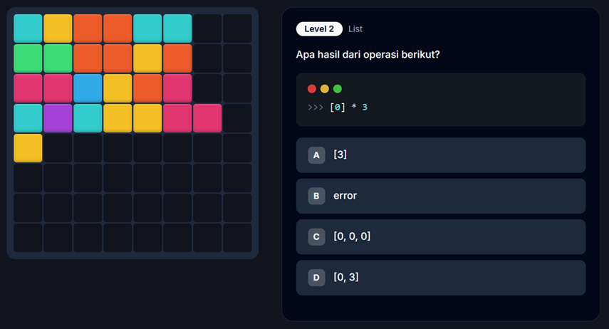

# 🐍 Python Block Blast

**Python Block Blast** adalah game puzzle edukasi yang menggabungkan mekanisme _Block Blast_ dengan tantangan coding Python.



## 🚀 Fitur Utama

- **Mekanisme Puzzle Seru:** Susun blok untuk menghancurkan baris dan kolom.
- **Tantangan Coding:** Jawab soal Python untuk mendapatkan blok baru.
- **Tiga Mode Game:**
  - **Classic:** Santai tanpa batas waktu.
  - **Challenge:** Uji kecepatan berpikir (30 detik per soal).
  - **Hardcore:** Mode ahli dengan waktu sangat ketat (15 detik).
- **Sistem Level:** Pertanyaan semakin sulit seiring bertambahnya skor.
- **Animasi Modern:** Efek visual saat membersihkan baris/kolom.

## 🛠️ Tech Stack

- **Framework:** React + Vite
- **Bahasa:** TypeScript
- **Styling:** Tailwind CSS + Shadcn/UI
- **State Management:** React Hooks
- **Deployment:** GitHub Actions & GitHub Pages

## 💻 Cara Menjalankan Secara Lokal

1. Clone repositori:
   ```bash
   git clone https://github.com/ihksanghazi/Python-Block-Blast.git
   ```
2. Masuk ke direktori:
   ```bash
   cd Python-Block-Blast
   ```
3. Install dependensi:
   ```bash
   npm install
   ```
4. Jalankan aplikasi:
   ```bash
   npm run dev
   ```
5. Buka `http://localhost:8080` di browser Anda.

## 🤝 Cara Kontribusi (Menambahkan Level/Soal)

Saya sangat terbuka bagi siapapun untuk kontribusi, terutama untuk memperbanyak bank soal Python!

### Langkah-langkah Menambahkan Soal:

1. **Fork** repositori ini.
2. Buat branch baru (`git checkout -b feature/tambah-soal`).
3. Cari file pertanyaan di `src/game/questions/`:
   - `level1.ts` (Dasar: Literals, Math)
   - `level2.ts` (List & Slicing)
   - `level3.ts` (Fungsi Bawaan: len, range)
   - `level4.ts` (Loops & Comprehension)
   - `level5.ts` (Conditionals & Logic)
4. Tambahkan objek pertanyaan baru sesuai format:
   ```typescript
   {
     id: "l1_unique_id",
     prompt: "Pertanyaan Anda di sini?",
     code: "x = 5\nprint(x + 2)", // Opsional: Kode yang ditampilkan
     options: ["7", "5", "2", "Error"],
     expectedAnswers: ["7"],
     hint: "Petunjuk jika pemain salah 3x",
     difficulty: 1, // Sesuai level file
     blockType: "small", // Pilihan: small, medium, large, l-shape, t-shape
   }
   ```
5. Commit perubahan Anda (`git commit -m 'Menambahkan soal tentang Dictionary'`).
6. Push ke branch (`git push origin feature/tambah-soal`).
7. Buat **Pull Request**.

## 📄 Lisensi

Proyek ini dilisensikan di bawah [MIT License](LICENSE).
